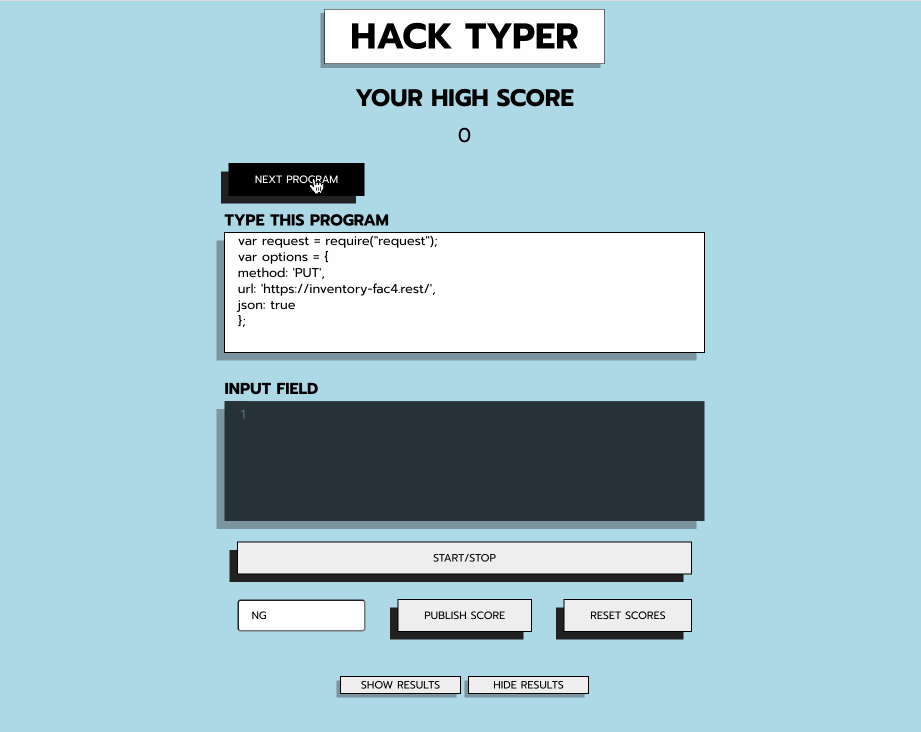

# Hack Typer 👨‍💻

A typing tool designed to help programmers improve their coding speed and accuracy through muscle memory repetition. Its unique feature focuses on coding-specific key sequences, setting it apart from other typing tutors.



## Installation

1. Clone this repo

2. Start the front-end of the project with npm

```bash
$ npm install
$ npm start
```

The front-end runs on http://localhost:3000/
## Tech Stack

**Client:** React, SASS, JavaScript

**Server:** Node, Express
